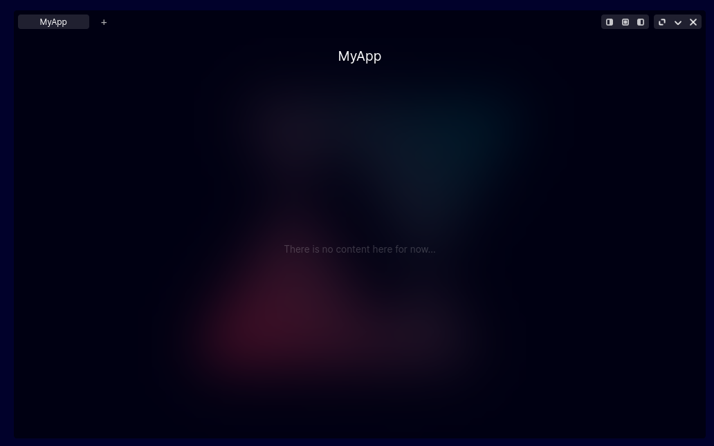

# About Placeholder

`Placeholder` is used to create default window content. It's easy to use to save place in code and CSS if there's currently no content for a window.

To add a placeholder, edit code in `demo.js`.

Example:
```js
var MyApp = new Placeholder("MyApp", "src/images/demo/icons/Apps/MyAppIconName.png");

apps_list = [
    // ...
    
	MyApp,
    
	// ...
]
```

