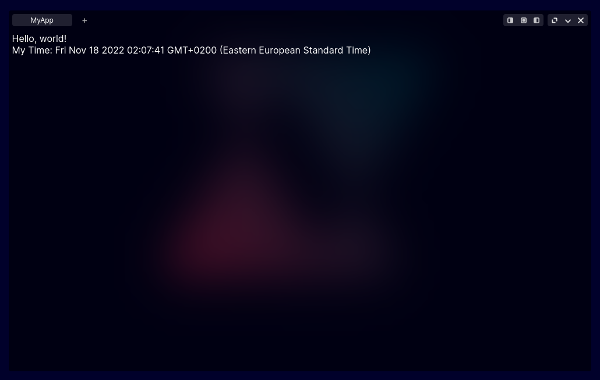

# Window content template & Adding your app to the dock

Here you can see a simple app template. You may create your app using it.

```js
class MyApp {

	static content;                                                 // content holder
	static title = "MyApp";                                         // app title
	static src = "src/images/demo/icons/Apps/MyAppIconName.png";    // your app icon path
	static extraClass = ["my-app", "extra-size", ];                 // some extra CSS classes for your window 
    static contextMenu = [                                          // context menu for your app (optional)
		...ContextMenu.defaultMenu,
		{
			"type" : "plain",
			"icon" : ContextIcons.download,
			"text" : "Download"
		},
		{
			"type" : "split",
		},
		{
			"type" : "plain",
			"icon" : ContextIcons.close,
			"text" : "Close"
		},
	]

	
	static {
        // some JS code to fill the 'content' variable

        // Example 
        var my_app_content = document.createElement("div");
		my_app_content.classList.add("my-app-content");
        my_app_content.innerHTML = "Hello, world!";

        var my_date = document.createElement("div");
		my_date.classList.add("date-now");

        my_app_content.appendChild(my_date);

        my_app_content.classList.add("noselect");
        MyApp.content = my_app_content;
    }

    static async onclone(content) {
        // some dynamic elements loading or event listeners adding

        // Example
        var date = new Date;
        content.querySelector(".date-now").innerHTML = `My Time: ${date.toString()}`;
    }

}
```

Here's our app.



### onclone works with clones

By default, dock uses cloning to open multiple apps each with its own context, so `onclone` is needed to load dynamic elements, while `content` is just a static template. 

`onclone` gets a cloned `content` as an argument, so it's a clone of your static template, not your initial `content` variable from class.

## Adding your app to dock

There are 2 steps to add your app to the demo (ex.: dock):

1. Load JS script

Open `index.html`, go to the `head` tag, and add your JS script like:

```html
    <head>
    
    // ...

        <!-- preloading -->
		// ...
		
        <link rel="preload" href="src/css/myapp.css" as="style"/>
		
        // ...

        <!-- CSS for apps -->
        // ...

		<link rel="stylesheet" href="src/css/myapp.css"/>

        // ...

		<!-- apps -->
		// ...
		
        <script src="src/js/myapp.js" defer></script>
		
        //...

    // ...

    </head>
```

2. Place it in dock

As an example, our app will be added to dock. We need to open `demo.js`, find there `apps_list` array and place there our app.

All apps are loaded from the first to the last, so your position depends on the place you've chosen.

```js
var apps_list = [
    // some apps
	
    MyApp,
    
    // some apps
]
```

## Reserve your app

If you want to create a specific app, but you haven't written your code yet, then you may use a [placeholder](Placeholder/about.mdx).