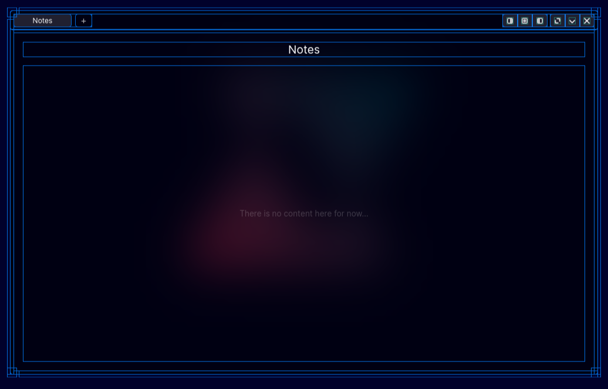

# About windows

Any Object, that has `win-tab`, `content-holder` and `icon-block` all with the same `win_num_g` id number can be considered a window.

You can spawn embeded windows using this by calling `makeWindow` and modifing it's output.

All `content-holder` Objects are in the window's `container`. This gives a tilling oportunity. 

All `icon-block` Objects are between `container` and `wl`.

All `win-tab` Objects are in `tab-holder` inserted before `tab-add` Object.

Dock underlines are connected with windows via `win_num_g` id, that is used while generation in `appBarGenerate`. Every window generation means incrementing this variable (`win_num_g`).

`icon-block` Objects are used to show icons in insert mode. They can be blank.

`content-holder` is used to limit content size and to give possibility to move it in different windows.

`win-tab` is used to manipulate window in inserted mode.